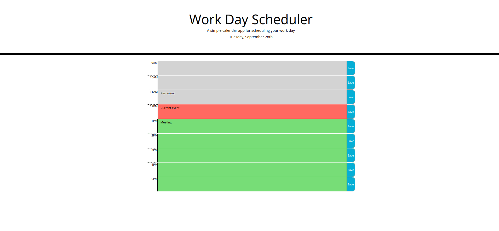

# Work Day Scheduler
This website is designed to help an employee plan their day. It allows the employee to save events for the hours in a standard workday. The site can be accessed [here.](https://zachary-berdell-elliott.github.io/day-planner/)

## Original site
The site originally just had a css stylesheet and html document. The document included links to bootstrap, jquery, and moment.js. It also had a header and a spot to store the time blocks.

## Site layout
The site includes a header with a title and a subtitle. Under that the current day is listed. There is then a section below that with standard business hours that the user can write and save events to.

## Event saving
Times are fetched and written using moment js. The user can write an element in the block and save an event to it by clicking the save button. The event will then be saved in the users local storage.

## Time block styling
The timeblocks will be color coded according to whether the hour is in the past present or future. The blocks are grey for past, red for present, and green for future.

##License
MIT

Copyright 2021 Zachary Elliott

Permission is hereby granted, free of charge, to any person obtaining a copy of this software and associated documentation files (the "Software"), to deal in the Software without restriction, including without limitation the rights to use, copy, modify, merge, publish, distribute, sublicense, and/or sell copies of the Software, and to permit persons to whom the Software is furnished to do so, subject to the following conditions:

The above copyright notice and this permission notice shall be included in all copies or substantial portions of the Software.

THE SOFTWARE IS PROVIDED "AS IS", WITHOUT WARRANTY OF ANY KIND, EXPRESS OR IMPLIED, INCLUDING BUT NOT LIMITED TO THE WARRANTIES OF MERCHANTABILITY, FITNESS FOR A PARTICULAR PURPOSE AND NONINFRINGEMENT. IN NO EVENT SHALL THE AUTHORS OR COPYRIGHT HOLDERS BE LIABLE FOR ANY CLAIM, DAMAGES OR OTHER LIABILITY, WHETHER IN AN ACTION OF CONTRACT, TORT OR OTHERWISE, ARISING FROM, OUT OF OR IN CONNECTION WITH THE SOFTWARE OR THE USE OR OTHER DEALINGS IN THE SOFTWARE.
